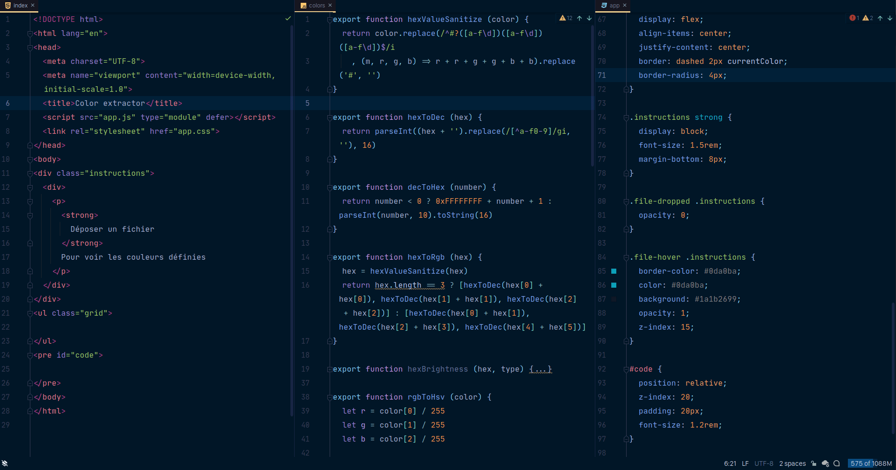

# Tokyo Night Color Scheme

A port of [Tokyo Night for VSCode](https://github.com/enkia/tokyo-night-vscode-theme) color scheme for jetbrains IDE (adapted for [Material Theme UI](https://plugins.jetbrains.com/plugin/8006-material-theme-ui) Night Owl theme). 

## Differences between this plugin and the one by [alexadhy](https://github.com/alexadhy/tokyonight-jetbrains)

- This plugin doesn't includes UI theme (only color scheme).
- This plugin is focused on PHPStorm supported languages
- A bit more colors for PHP language
